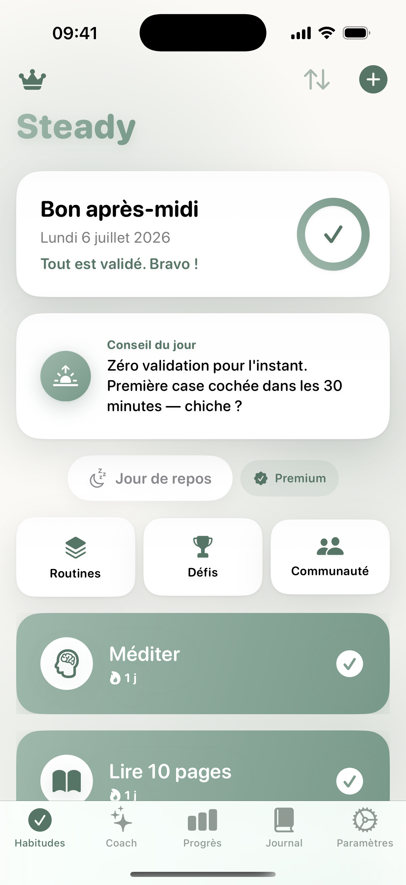
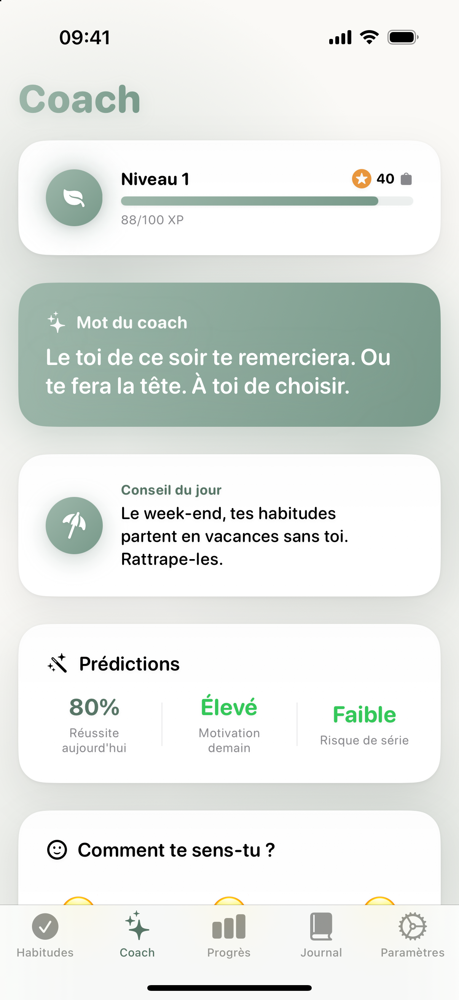
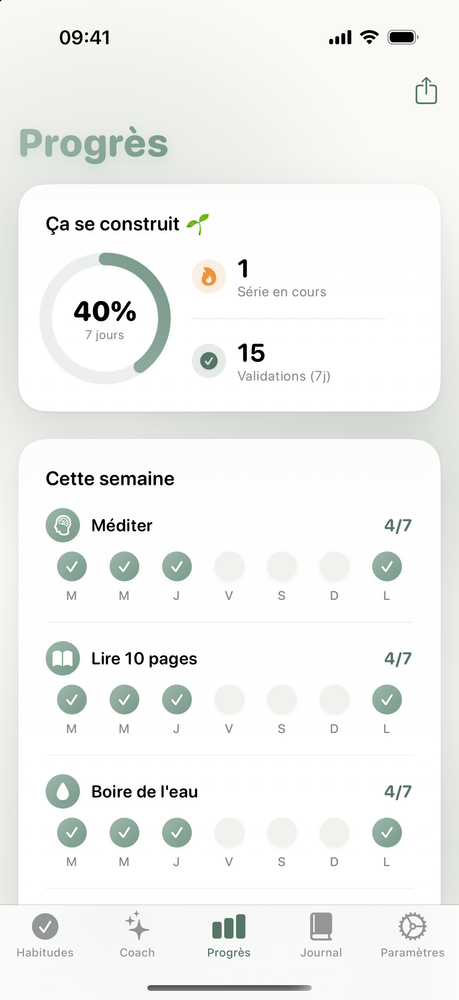

# Steady 🌿

**A guilt-free habit tracker for iOS — gentle on you, serious about consistency.**

Built 100% in Swift & SwiftUI: iPhone app, watchOS companion and an interactive home-screen widget.

  
  
  

## What it does

- **Habit tracking, without the guilt** — yes/no habits or counters (8 glasses of water…), per-weekday scheduling, retroactive check-ins.
- **Streaks that forgive** — a *Rest Day* protects every streak, and a broken streak can be repaired with coins earned in the app. Missing one day should never mean losing everything.
- **An on-device coach** — daily insights generated locally from your real data: best/worst weekday, trends, completion predictions, and a "word of the coach" that teases you into action.
- **Progress that feels good** — animated weekly ring, monthly heatmap, badges, and advanced Swift Charts stats.
- **Challenges with friends** — join catalog challenges or create your own, invite friends, and watch everyone's progress live.
- **Community** — username search, friend requests (accept/decline), leaderboards and group chat.
- **Journal & mood** — quick daily notes with mood tracking, correlated with your habits.
- **Gamification** — XP, levels, coins, avatar shop, full-screen celebrations.
- **Widget & Apple Watch** — check habits from the home screen (interactive WidgetKit) or your wrist.

## Tech stack

| Area | Choices |
|---|---|
| UI | SwiftUI, Swift Charts, WidgetKit (interactive), watchOS companion |
| Architecture | MVVM with `@Observable`, protocol-oriented services (swappable mock/Firebase backends) |
| Persistence | SwiftData (local-first), App Group shared snapshot for the widget |
| Backend | Firebase Auth (Sign in with Apple) + Firestore — **social features only** |
| Monetization | StoreKit 2 (subscriptions + lifetime), rewarded ads (Google Mobile Ads + UMP consent for GDPR) |
| Quality | String Catalogs — 4 languages (FR/EN/ES/PT), VoiceOver & Dynamic Type, dark mode, battery-conscious rendering (no infinite animations, cached streak computations) |

## Architecture notes

- **Local-first & private by design**: habit data never leaves the device. Only the opt-in social layer (username, streak count, shared challenges) touches Firestore — the security rules live in [`firestore.rules`](firestore.rules).
- **`SocialService` protocol** with two implementations (Firebase & in-memory mock) so the entire social UI can be developed and tested offline.
- **Entitlements as a single source of truth**: `isPremium = StoreKit purchase OR rewarded 24h trial (expiring date)` — the paywall, gating and ad button all read one flag.
- **Performance passes**: streak computations cache their UserDefaults reads, widget snapshots are written once per mutation, and every decorative animation is finite.

## Privacy

No accounts required for the core app. Habits, journal and stats stay on device. The privacy policy and GDPR consent flow (UMP) ship with the app.

---

Built by **Rodrigo Bouabida** — ex-executive chef, now iOS developer.
📄 [My CV, built as an iOS app →](https://rodisteph.github.io/CV)
